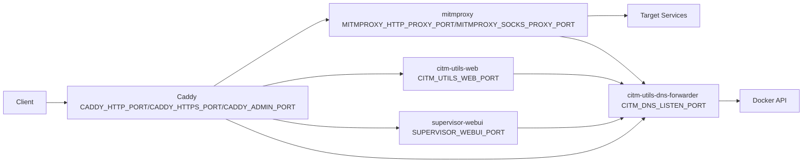

# Architecture

## Context

CITM packages multiple network-debugging responsibilities into one container.
The runtime manages TLS termination, MITM inspection, service discovery, and
operator APIs in one deployable unit.

## Mechanics

The container starts `supervisord`, which launches these processes:

- `caddy`: ingress and admin virtual-host routing
- `mitmproxy` (`mitmweb`): HTTP/S proxying and flow capture
- `citm-utils-web`: utility HTTP APIs
- `supervisor-webui`: supervisor UI and control API
- `citm-utils-dns-forwarder`: DNS interception for the entire container

The DNS forwarder updates container resolver behavior to localhost, so all
processes in the container resolve through `citm-utils-dns-forwarder`. The DNS
forwarder queries the Docker API to build container label-based DNS records.
Default values for the runtime ports are documented in
[Default Ports](../reference/default-ports.md).

## Why this design

- One container reduces setup variance across local development and tests.
- Caddy handles certificates and domain-based ingress.
- mitmproxy provides protocol-aware interception and inspection.
- Utility API exposes machine-readable operational state.
- DNS forwarder allows label-based service discovery without host DNS changes.

## Tradeoffs

- Process coupling in one container increases blast radius for runtime failures.
- Docker socket mount is required for discovery and increases host integration
  requirements.
- TLS and proxy behavior can hide direct backend failures without explicit
  inspection.

## Operational consequences

- Certificate files must be mounted before startup.
- Service discovery contracts depend on exact Docker labels.
- Health checks cover Docker access, DNS resolution, and internal routing.
- `mitmproxy` runs under a PTY wrapper in `supervisord`. This preserves
  `mitmweb` log output on container stdout and stderr.
