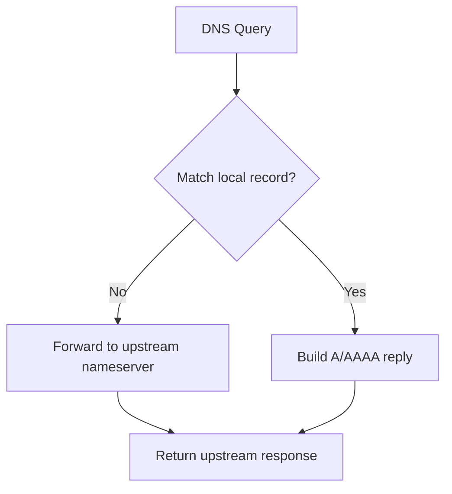

# DNS Discovery and Forwarding

## Context

CITM resolves service names from Docker labels and forwards unmatched DNS
queries to upstream nameservers.

## Mechanics

1. Discovery reads running containers from Docker API.
1. Containers with `citm_network` and `citm_dns_names` labels are selected.
1. DNS names are normalized (trimmed, lowercase, trailing dot removed).
1. Records are cached for a short TTL.
1. Query handling chooses longest matching suffix from discovered and static
   records.
1. `A`/`AAAA`/`ANY` for matched names are answered locally.
1. Unmatched names are forwarded to upstream resolvers over UDP/TCP.

## Why this design

- Label-based discovery removes manual DNS record maintenance.
- Short cache windows keep container IP changes visible quickly.
- Upstream forwarding preserves normal DNS behavior for non-CITM domains.

## Tradeoffs

- Docker API dependency couples DNS availability to Docker socket access.
- Cache refresh can introduce short windows with stale records.
- DNS forwarder process manages `/etc/resolv.conf`, which changes container
  resolver behavior.

## Operational consequences

- Discovery network selection should be explicit in multi-network deployments.
- Missing labels or network mismatch silently remove names from local answers.
- Upstream resolver absence causes unmatched queries to return `SERVFAIL`.
