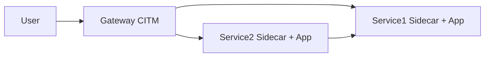

# Gateway vs Sidecar Topologies

## Context

CITM supports two dominant deployment patterns:

- Gateway topology: one ingress proxy for multiple services
- Sidecar topology: one proxy sidecar per service network namespace

## Mechanics

Gateway pattern:

- Host traffic enters one CITM instance on `80`/`443`.
- Caddy routes requests to service internal names.
- Admin endpoints are exposed at `*.citm.localhost`.

Sidecar pattern:

- Each service has a colocated CITM instance.
- Application shares network namespace with sidecar.
- Gateway can proxy sidecar admin endpoints with subdomain routing.

## Why this design

- Gateway mode centralizes ingress and operator tooling.
- Sidecar mode isolates service-level traffic and debugging context.
- Combined topology supports north-south and east-west inspection.

## Tradeoffs

- Gateway-only deployment can reduce per-service isolation.
- Sidecar deployment increases container count and orchestration overhead.
- Mixed topology requires careful domain and route naming conventions.

## Operational consequences

- Sidecar-admin access depends on gateway Caddy wildcard route correctness.
- Service-local TLS trust must be configured for sidecar clients.
- Flow analysis should separate gateway and sidecar `mitm` endpoints.
