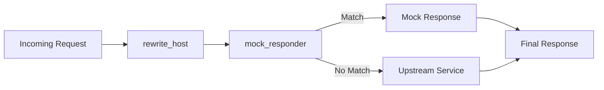

# Mocking and Rewrite Pipeline

## Context

CITM uses two mitmproxy addons for programmable behavior:

- `rewrite_host`: routes requests to target hosts from headers
- `mock_responder`: serves template-based mock responses

## Mechanics

`rewrite_host` mechanics:

- Reads `X-MITM-To` and validates `host:port`.
- Marks flows when `X-MITM-Emoji` is provided.
- Rewrites request host and port for upstream forwarding.
- Preserves original host header for protocol compatibility.

`mock_responder` mechanics:

- Loads files from `MOCK_PATHS` patterns.
- Parses request matcher, status/headers, and template remainder.
- Resolves exact matches before wildcard `fnmatch` patterns.
- Renders response body with Mako `flow` context.
- Optionally fetches external body when rendered content starts with `@@`.
- Normalizes response headers for HTTP/2 and HTTP/3.

## Why this design

- Routing and response substitution remain independent concerns.
- File-based mocks allow versioned and reviewable test fixtures.
- Mako templates allow request-aware dynamic response generation.

## Tradeoffs

- Runtime parsing of mock files can add overhead in large mock sets.
- Template errors degrade to raw content and can hide authoring issues.
- External fetch behavior introduces network dependency inside request handling.

## Operational consequences

- Mock file syntax and section boundaries are strict.
- Invalid target headers are blocked before upstream calls.
- Protocol-specific header normalization affects observable mock responses.
