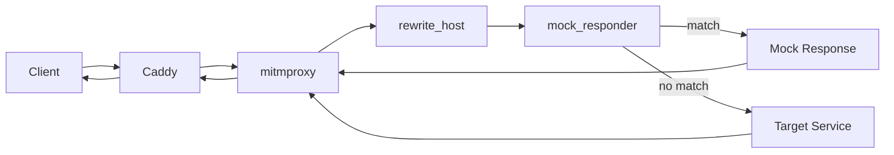

# Request Flow

## Context

HTTP requests can enter CITM as gateway ingress traffic or as explicit proxy
traffic. Both paths are processed by mitmproxy addons before upstream delivery.

## Mechanics

Gateway ingress flow:

1. Client connects to Caddy on `80` or `443`.
1. Site block forwards to `mitm` upstream.
1. Request includes `X-MITM-To` target and optional `X-MITM-Emoji` marker.
1. `rewrite_host` validates and rewrites upstream host/port.
1. `mock_responder` checks exact and wildcard mock rules.
1. On match, `mock_responder` returns a synthetic response.
1. On miss, mitmproxy forwards request to target service.
1. Response returns through mitmproxy and Caddy to client.

Admin flow:

- `utils.citm.*` hosts route to `citm-utils-web`.
- `mitm.citm.*` hosts route to `mitmweb` backend.

## Why this design

- Header-driven target routing keeps Caddy config concise.
- Mocking remains independent from host rewrite logic.
- Admin and utility traffic remains available under the same TLS model.

## Tradeoffs

- Routing depends on valid `X-MITM-To`; malformed values block requests.
- Multiple layers increase troubleshooting steps for simple connectivity issues.
- Mock behavior can mask backend failures unless responses are inspected.

## Operational consequences

- Caddy route definitions must set target and host headers correctly.
- Flow inspection in `mitmweb` is required for root-cause analysis.
- HAR exports depend on mitmproxy flow dump availability.
