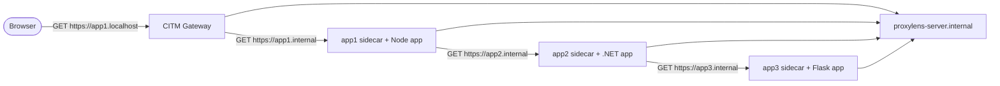

# ProxyLens

This tutorial builds a topology with one gateway and three services. Each
service has its own CITM sidecar.

Each sidecar provides three core capabilities for its service:

1. Discovery through CITM DNS for internal service names such as
   `app1.internal`.
1. TLS termination for traffic addressed to those internal service names.
1. CITM traffic features at that hop, including inspection, mocking, and
   ProxyLens event capture.

Each sidecar includes its own `mitmproxy` instance. This supports inspection of
the traffic that arrives at one specific service. That is useful for debugging a
single hop, but it does not provide one combined view of a request that crosses
multiple services.

ProxyLens solves that problem. ProxyLens is a request-tracking interface
included in CITM. It collects request and response events from multiple CITM
instances, correlates them across service boundaries, and presents them in one
view. When services propagate OpenTelemetry headers, ProxyLens groups those hops
into one trace and renders them as a sequence diagram.

This tutorial creates the following request path:



### Prerequisites

The following tools are required:

- **Docker** and **Docker Compose**
- **cURL**
- **cfssl** and **cfssljson**
- Stop other tutorial stacks before running this one. Multiple examples bind
  host ports `80/443`.

The shared example helper creates `my-citm-network` and generates example
certificates when they do not already exist. Certificate generation is
documented in
**[Development Root CA Generation](../how-to/create-dev-root-ca.md)**.

### Gateway Stack

The gateway is the browser-facing entry point. It also runs the shared ProxyLens
server.

File: `examples/chained-apps-with-proxylens/gateway/compose.yml`

```yaml
name: citm-examples-chained-apps-with-proxylens-gateway

services:
  citm:
    image: fardjad/citm:latest
    volumes:
      - /var/run/docker.sock:/var/run/docker.sock:ro
      - ../certs:/certs:ro
      - ./caddy-conf.d:/etc/caddy/conf.d:ro
    environment:
      - CITM_NETWORK=my-citm-network
      - ENABLE_PROXYLENS_SERVER=true
      - PROXYLENS_NODE_NAME=gateway
      - PROXYLENS_MAX_CONCURRENT_REQUESTS_PER_HOST=1
    ports:
      - "0.0.0.0:80:80"
      - "0.0.0.0:443:443"
      - "0.0.0.0:443:443/udp"
    networks:
      - my-citm-network
    labels:
      - citm_network=my-citm-network
      - citm_dns_names=gateway.internal,proxylens-server.internal

networks:
  my-citm-network:
    name: my-citm-network
    external: true
```

The label `proxylens-server.internal` gives every sidecar one stable DNS name
for the shared ProxyLens server.

Add the public route for `app1.localhost`.

File: `examples/chained-apps-with-proxylens/gateway/caddy-conf.d/app1.conf`

```caddy
app1.localhost {
	import dev_certs

	reverse_proxy {
		to mitm

		header_up X-MITM-Emoji ":one:"
		header_up X-MITM-To "app1.internal:443"
		header_up Host "app1.internal"

		transport http {
			tls
		}
	}
}
```

Add administrative routes for the gateway and the sidecars.

File: `examples/chained-apps-with-proxylens/gateway/caddy-conf.d/citm.conf`

```caddy
*.citm.localhost {
	import dev_certs

	reverse_proxy {
		to "{labels.2}.citm.localhost:{$CADDY_ADMIN_PORT}"

		transport http {
			tls
			network_proxy none
		}
	}
}

*.citm.app1.localhost {
	import dev_certs

	reverse_proxy {
		to "app1.internal:{$CADDY_ADMIN_PORT}"
		header_up Host "{labels.3}.citm.localhost:{$CADDY_ADMIN_PORT}"

		transport http {
			tls
			tls_server_name citm.localhost
			network_proxy none
		}
	}
}

*.citm.app2.localhost {
	import dev_certs

	reverse_proxy {
		to "app2.internal:{$CADDY_ADMIN_PORT}"
		header_up Host "{labels.3}.citm.localhost:{$CADDY_ADMIN_PORT}"

		transport http {
			tls
			tls_server_name citm.localhost
			network_proxy none
		}
	}
}

*.citm.app3.localhost {
	import dev_certs

	reverse_proxy {
		to "app3.internal:{$CADDY_ADMIN_PORT}"
		header_up Host "{labels.3}.citm.localhost:{$CADDY_ADMIN_PORT}"

		transport http {
			tls
			tls_server_name citm.localhost
			network_proxy none
		}
	}
}
```

### app1 Stack

`app1` is the browser-facing application. It calls `app2` over HTTPS on the
internal CITM network.

The sidecar registers `app1.internal`, terminates TLS for that name, forwards
traffic to the local app on port `8080`, and emits ProxyLens events for the
`app1` hop.

File: `examples/chained-apps-with-proxylens/app1/compose.yml`

```yaml
name: citm-examples-chained-apps-with-proxylens-app1

services:
  app1:
    build:
      context: .
      dockerfile: Dockerfile
    volumes:
      - ../certs:/certs:ro
    environment:
      # OTEL
      - OTEL_SERVICE_NAME=app1
      - OTEL_TRACES_EXPORTER=console
      - OTEL_METRICS_EXPORTER=console
      - OTEL_LOGS_EXPORTER=console

      # Node.js proxy support:
      # https://nodejs.org/en/learn/http/enterprise-network-configuration
      # Enable built-in proxy support so fetch() sends outbound requests
      # through the local CITM sidecar listener.
      - HTTP_PROXY=http://127.0.0.1:19080
      - HTTPS_PROXY=http://127.0.0.1:19080
      - NODE_USE_ENV_PROXY=1
      # Trust the CITM root CA so Node accepts TLS certificates for
      # intercepted internal HTTPS traffic.
      - NODE_EXTRA_CA_CERTS=/certs/rootCA.pem

      # Application configuration
      - SERVICE2_BASE_URL=https://app2.internal/
    network_mode: "service:citm-sidecar-app1"
    init: true
    tty: true

  citm-sidecar-app1:
    image: fardjad/citm:latest
    volumes:
      - /var/run/docker.sock:/var/run/docker.sock:ro
      - ../certs:/certs:ro
      - ./caddy-conf.d:/etc/caddy/conf.d:ro
    environment:
      - CITM_NETWORK=my-citm-network
      - PROXYLENS_NODE_NAME=app1
      - PROXYLENS_SERVER_BASE_URL=http://proxylens-server.internal:19003
      - PROXYLENS_MAX_CONCURRENT_REQUESTS_PER_HOST=1
    networks:
      - my-citm-network
    labels:
      - citm_network=my-citm-network
      - citm_dns_names=app1.internal
    init: true
    tty: true

networks:
  my-citm-network:
    name: my-citm-network
    external: true
```

File: `examples/chained-apps-with-proxylens/app1/caddy-conf.d/app1.conf`

```caddy
app1.internal {
	import dev_certs

	reverse_proxy {
		to mitm

		header_up X-MITM-Emoji ":one:"
		header_up X-MITM-To "localhost:8080"
		header_up Host "localhost:8080"
	}
}
```

File: `examples/chained-apps-with-proxylens/app1/Dockerfile`

```dockerfile
FROM node:lts-trixie

WORKDIR /app

COPY package.json package-lock.json ./
RUN npm ci

COPY index.mjs ./
COPY telemetry.mjs ./

EXPOSE 8080

CMD ["node", "--import=/app/telemetry.mjs", "/app/index.mjs"]
```

Install the Node dependencies for `app1`:

```bash
npm install \
  @fastify/otel \
  @opentelemetry/api \
  @opentelemetry/auto-instrumentations-node \
  fastify \
  @opentelemetry/instrumentation \
  @opentelemetry/sdk-node
```

File: `examples/chained-apps-with-proxylens/app1/telemetry.mjs`

```js
import { register } from "node:module";
import { pathToFileURL } from "node:url";
import { FastifyOtelInstrumentation } from "@fastify/otel";
import { getNodeAutoInstrumentations } from "@opentelemetry/auto-instrumentations-node";
import { NodeSDK } from "@opentelemetry/sdk-node";

register("@opentelemetry/instrumentation/hook.mjs", pathToFileURL("./"));

const sdk = new NodeSDK({
  instrumentations: [
    getNodeAutoInstrumentations(),
    new FastifyOtelInstrumentation({ registerOnInitialization: true })
  ]
});

sdk.start();
```

File: `examples/chained-apps-with-proxylens/app1/index.mjs`

```js
import process from "node:process";
import Fastify from "fastify";

const HOST = process.env.HOST ?? "0.0.0.0";
const PORT = Number(process.env.PORT ?? "8080");
const serviceName = process.env.OTEL_SERVICE_NAME ?? "app1";
const service2BaseUrl = process.env.SERVICE2_BASE_URL;

const app = Fastify({ logger: true });

app.get("/", async (_req, reply) => {
  try {
    const response = await fetch(service2BaseUrl, {
      method: "GET",
      headers: { accept: "application/json" },
      signal: AbortSignal.timeout(10_000)
    });

    if (!response.ok) {
      throw new Error(`received status ${response.status}`);
    }

    return {
      service: serviceName,
      message: `${serviceName} called app2`,
      downstream: await response.json()
    };
  } catch (error) {
    reply.code(502);
    return {
      service: serviceName,
      error: `downstream request failed: ${error.message}`
    };
  }
});

await app.listen({ host: HOST, port: PORT });
```

### app2 Stack

`app2` is an internal service. It receives traffic from `app1`, calls
`app3.internal`, and emits ProxyLens events for the `app2` hop.

File: `examples/chained-apps-with-proxylens/app2/compose.yml`

```yaml
name: citm-examples-chained-apps-with-proxylens-app2

services:
  app2:
    build:
      context: .
      dockerfile: Dockerfile
    volumes:
      # Mount the shared CITM root CA so the entrypoint can install it into
      # the container trust store for intercepted internal HTTPS traffic.
      - ../certs:/certs:ro
    environment:
      # OTEL
      - OTEL_SERVICE_NAME=app2

      # .NET proxy support:
      # https://learn.microsoft.com/en-us/dotnet/api/system.net.http.httpclient.defaultproxy
      # HttpClient uses these variables so outbound requests go through the
      # local CITM sidecar listener.
      - HTTP_PROXY=http://127.0.0.1:19080
      - HTTPS_PROXY=http://127.0.0.1:19080

      # Application configuration
      - SERVICE3_BASE_URL=https://app3.internal/
    network_mode: "service:citm-sidecar-app2"
    init: true
    tty: true

  citm-sidecar-app2:
    image: fardjad/citm:latest
    volumes:
      - /var/run/docker.sock:/var/run/docker.sock:ro
      - ../certs:/certs:ro
      - ./caddy-conf.d:/etc/caddy/conf.d:ro
    environment:
      - CITM_NETWORK=my-citm-network
      - PROXYLENS_NODE_NAME=app2
      - PROXYLENS_SERVER_BASE_URL=http://proxylens-server.internal:19003
      - PROXYLENS_MAX_CONCURRENT_REQUESTS_PER_HOST=1
    networks:
      - my-citm-network
    labels:
      - citm_network=my-citm-network
      - citm_dns_names=app2.internal
    init: true
    tty: true

networks:
  my-citm-network:
    name: my-citm-network
    external: true
```

File: `examples/chained-apps-with-proxylens/app2/caddy-conf.d/app2.conf`

```caddy
app2.internal {
	import dev_certs

	reverse_proxy {
		to mitm

		header_up X-MITM-Emoji ":two:"
		header_up X-MITM-To "localhost:8080"
		header_up Host "localhost:8080"
	}
}
```

File: `examples/chained-apps-with-proxylens/app2/Dockerfile`

```dockerfile
FROM mcr.microsoft.com/dotnet/sdk:10.0 AS build

WORKDIR /src

COPY app2.csproj /src/app2.csproj
RUN dotnet restore /src/app2.csproj

COPY Program.cs /src/Program.cs
RUN dotnet publish /src/app2.csproj -c Release -o /app/publish

FROM mcr.microsoft.com/dotnet/aspnet:10.0

WORKDIR /app

ENV ASPNETCORE_HTTP_PORTS=

RUN apt-get update \
    && apt-get install -y --no-install-recommends ca-certificates \
    && rm -rf /var/lib/apt/lists/*

COPY --from=build /app/publish /app
COPY entrypoint.sh /app/entrypoint.sh

RUN chmod +x /app/entrypoint.sh

EXPOSE 8080

ENTRYPOINT ["/app/entrypoint.sh"]
```

Install the .NET packages for `app2`:

```bash
dotnet add package OpenTelemetry.Extensions.Hosting
dotnet add package OpenTelemetry.Instrumentation.AspNetCore
dotnet add package OpenTelemetry.Instrumentation.Http
```

File: `examples/chained-apps-with-proxylens/app2/entrypoint.sh`

```sh
#!/bin/sh
set -eu

cp /certs/rootCA.pem /usr/local/share/ca-certificates/citm-root-ca.crt
update-ca-certificates >/dev/null 2>&1

exec dotnet /app/app2.dll
```

File: `examples/chained-apps-with-proxylens/app2/Program.cs`

```csharp
using System.Net.Http.Headers;
using System.Text.Json;
using OpenTelemetry.Trace;

var serviceName = Environment.GetEnvironmentVariable("OTEL_SERVICE_NAME") ?? "app2";
var service3BaseUrl = Environment.GetEnvironmentVariable("SERVICE3_BASE_URL")
    ?? "https://app3.internal/";

var builder = WebApplication.CreateBuilder(args);
builder.WebHost.UseUrls("http://0.0.0.0:8080");

builder.Services.AddHttpClient("downstream", client =>
{
    client.DefaultRequestHeaders.Accept.Add(
        new MediaTypeWithQualityHeaderValue("application/json"));
    client.Timeout = TimeSpan.FromSeconds(10);
});

builder.Services
    .AddOpenTelemetry()
    .WithTracing(tracing => tracing
        .AddAspNetCoreInstrumentation()
        .AddHttpClientInstrumentation());

var app = builder.Build();

app.MapGet("/", async (HttpContext context, IHttpClientFactory httpClientFactory) =>
{
    try
    {
        var client = httpClientFactory.CreateClient("downstream");
        using var response = await client.GetAsync(service3BaseUrl, context.RequestAborted);
        response.EnsureSuccessStatusCode();

        var downstream = await response.Content.ReadFromJsonAsync<JsonElement>(
            cancellationToken: context.RequestAborted);

        return Results.Json(new
        {
            service = serviceName,
            message = $"{serviceName} called app3",
            downstream,
        });
    }
    catch (Exception exception)
    {
        return Results.Json(new
        {
            service = serviceName,
            error = $"downstream request failed: {exception.Message}",
        }, statusCode: StatusCodes.Status502BadGateway);
    }
});

await app.RunAsync();
```

### app3 Stack

`app3` is the last service in the chain. It returns the final response payload
and emits ProxyLens events for the `app3` hop.

File: `examples/chained-apps-with-proxylens/app3/compose.yml`

```yaml
name: citm-examples-chained-apps-with-proxylens-app3

services:
  app3:
    build:
      context: .
      dockerfile: Dockerfile
    environment:
      # OTEL
      - OTEL_SERVICE_NAME=app3
      - OTEL_TRACES_EXPORTER=console
      - OTEL_METRICS_EXPORTER=console
      - OTEL_LOGS_EXPORTER=console
    network_mode: "service:citm-sidecar-app3"
    init: true
    tty: true

  citm-sidecar-app3:
    image: fardjad/citm:latest
    volumes:
      - /var/run/docker.sock:/var/run/docker.sock:ro
      - ../certs:/certs:ro
      - ./caddy-conf.d:/etc/caddy/conf.d:ro
    environment:
      - CITM_NETWORK=my-citm-network
      - PROXYLENS_NODE_NAME=app3
      - PROXYLENS_SERVER_BASE_URL=http://proxylens-server.internal:19003
      - PROXYLENS_MAX_CONCURRENT_REQUESTS_PER_HOST=1
    networks:
      - my-citm-network
    labels:
      - citm_network=my-citm-network
      - citm_dns_names=app3.internal
    init: true
    tty: true

networks:
  my-citm-network:
    name: my-citm-network
    external: true
```

File: `examples/chained-apps-with-proxylens/app3/caddy-conf.d/app3.conf`

```caddy
app3.internal {
	import dev_certs

	reverse_proxy {
		to mitm

		header_up X-MITM-Emoji ":three:"
		header_up X-MITM-To "localhost:8080"
		header_up Host "localhost:8080"
	}
}
```

File: `examples/chained-apps-with-proxylens/app3/Dockerfile`

```dockerfile
FROM python:3-trixie

ENV PYTHONDONTWRITEBYTECODE=1
ENV PYTHONUNBUFFERED=1

WORKDIR /app

COPY --from=ghcr.io/astral-sh/uv:latest /uv /uvx /bin/

COPY pyproject.toml uv.lock /app/
RUN uv sync --frozen

COPY app.py /app/app.py

EXPOSE 8080

CMD ["uv", "run", "opentelemetry-instrument", "python", "/app/app.py"]
```

Initialize the Python dependencies for `app3` with `uv`:

```bash
uv init --name citm-chained-apps-with-proxylens-app3
uv add flask opentelemetry-distro
uv run opentelemetry-bootstrap -a requirements | uv add --requirement -
uv lock
```

File: `examples/chained-apps-with-proxylens/app3/pyproject.toml`

```toml
[project]
name = "citm-chained-apps-with-proxylens-app3"
version = "0.1.0"
description = "Flask app for the chained apps with ProxyLens example"
requires-python = ">=3.11"
dependencies = [
    "flask",
    "opentelemetry-distro",
    "opentelemetry-instrumentation-asyncio==0.61b0",
    "opentelemetry-instrumentation-click==0.61b0",
    "opentelemetry-instrumentation-dbapi==0.61b0",
    "opentelemetry-instrumentation-flask==0.61b0",
    "opentelemetry-instrumentation-jinja2==0.61b0",
    "opentelemetry-instrumentation-logging==0.61b0",
    "opentelemetry-instrumentation-sqlite3==0.61b0",
    "opentelemetry-instrumentation-threading==0.61b0",
    "opentelemetry-instrumentation-urllib==0.61b0",
    "opentelemetry-instrumentation-wsgi==0.61b0",
]
```

File: `examples/chained-apps-with-proxylens/app3/app.py`

```python
import os
from flask import Flask

SERVICE_NAME = os.environ.get("OTEL_SERVICE_NAME", "app3")

app = Flask(__name__)


@app.get("/")
def index():
    return {
        "service": SERVICE_NAME,
        "message": f"hello from {SERVICE_NAME}",
    }, 200


if __name__ == "__main__":
    app.run(host="0.0.0.0", port=8080, debug=False)
```

### Run the Topology

Start the Docker network if it does not already exist:

```bash
docker network create my-citm-network
```

Start the gateway:

```bash
cd examples/chained-apps-with-proxylens/gateway
docker compose up -d --wait --pull always --build --force-recreate
```

This step starts the browser-facing entry point and the shared ProxyLens server.

Start the downstream services from the end of the chain toward the beginning:

```bash
cd ../app3
docker compose up -d --wait --pull always --build --force-recreate

cd ../app2
docker compose up -d --wait --pull always --build --force-recreate

cd ../app1
docker compose up -d --wait --pull always --build --force-recreate
```

This order ensures that each downstream dependency is already available when the
next service begins forwarding traffic to it.

Check that the containers are running:

```bash
(cd examples/chained-apps-with-proxylens/gateway && docker compose ps)
(cd examples/chained-apps-with-proxylens/app1 && docker compose ps)
(cd examples/chained-apps-with-proxylens/app2 && docker compose ps)
(cd examples/chained-apps-with-proxylens/app3 && docker compose ps)
```

Check the browser entrypoint:

```bash
curl -k https://app1.localhost
```

The response contains the full chain. The top-level object identifies `app1`,
and the nested `downstream` objects include `app2` and `app3`. This confirms
that the gateway route, internal DNS, internal TLS, and service-to-service calls
are working.

### Inspect Local Hops

Each CITM instance exposes its own `mitmproxy` interface:

- `https://mitm.citm.localhost`
- `https://mitm.citm.app1.localhost`
- `https://mitm.citm.app2.localhost`
- `https://mitm.citm.app3.localhost`

These views show traffic captured at one hop. For example,
`https://mitm.citm.app1.localhost` shows the requests that reach the `app1`
sidecar.

### Inspect Aggregated Traffic in ProxyLens

Open the aggregated ProxyLens view:

```text
https://proxylens.citm.localhost
```

The ProxyLens view shows one request path that starts at `gateway` and continues
through `app1`, `app2`, and `app3`. The request and response seen at each hop
appear in one place instead of in separate `mitmproxy` views.

ProxyLens also exposes a REST API. Captured request summaries can be queried
directly:

```bash
curl -k "https://proxylens.citm.localhost/api/requests?limit=100"
```

The response includes requests whose `hop_nodes` contain `gateway`, `app1`,
`app2`, and `app3`. This confirms that ProxyLens received events from the
gateway and all three sidecars and aggregated them into one connected path.

### Stop the Topology

```bash
(cd examples/chained-apps-with-proxylens/app1 && docker compose down)
(cd examples/chained-apps-with-proxylens/app2 && docker compose down)
(cd examples/chained-apps-with-proxylens/app3 && docker compose down)
(cd examples/chained-apps-with-proxylens/gateway && docker compose down)
```
