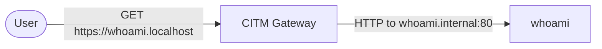

# Getting Started

This tutorial walks through the smallest useful setup for Caddy in the Middle
(CITM): one CITM gateway container and one `whoami` application container on the
same Docker network, with no sidecar.

### Prerequisites

The following tools are required:

- **Docker** and **Docker Compose**

- A Root CA certificate and key (`rootCA.pem`, `rootCA-key.pem`)

- **cURL**

- Stop other tutorial stacks before running this one. Multiple examples bind
  host ports `80/443`.

- An external Docker network named `my-citm-network`. Initialize it via:

  ```bash
  docker network create my-citm-network
  ```

Certificate generation is documented in
**[Development Root CA Generation](../how-to/create-dev-root-ca.md)**.

### Architecture

- **CITM gateway**: Exposes ports `80/443`, discovers labeled containers, and
  routes requests.
- **whoami**: A simple HTTP app that is registered in CITM DNS using Docker
  labels.



### Gateway Service

File: `examples/getting-started/compose.yml`

```yaml
name: citm-examples-getting-started

services:
  citm:
    image: fardjad/citm:latest
    volumes:
      # Required for service discovery
      - /var/run/docker.sock:/var/run/docker.sock:ro
      # A directory containing rootCA.pem and rootCA-key.pem
      - ./certs:/certs:ro
      # A directory containing Caddy config files
      - ./caddy-conf.d:/etc/caddy/conf.d:ro
    environment:
      # Discover services in this network
      - CITM_NETWORK=my-citm-network
    ports:
      # Caddy ports
      - "0.0.0.0:80:80"
      - "0.0.0.0:443:443"
      - "0.0.0.0:443:443/udp"
    networks:
      - my-citm-network

networks:
  my-citm-network:
    name: my-citm-network
    external: true
```

Gateway routing rules for public hostnames are defined in
`examples/getting-started/caddy-conf.d/whoami.conf`:

```caddy
whoami.localhost {
	import dev_certs

	reverse_proxy {
		# Send traffic through mitmproxy and forward to the labeled whoami target
		to mitm
		header_up X-MITM-To "whoami.internal:80"
		header_up Host "whoami.internal:80"
	}
}
```

### Backend Service

The application service is defined in the same
`examples/getting-started/compose.yml` file:

```yaml
  whoami:
    image: traefik/whoami
    networks:
      - my-citm-network
    labels:
      # Register this service in the CITM network
      - citm_network=my-citm-network
      - citm_dns_names=whoami.internal
```

### Inspecting the Environment

Stack startup command:

```bash
cd examples/getting-started
docker compose up -d \
  --wait \
  --pull always \
  --build \
  --force-recreate
```

#### 1. External Access

External reachability check for `whoami` through the gateway:

```bash
curl -k https://whoami.localhost
```

#### 2. DNS Registration

DNS registration check for `whoami.internal` in CITM:

```bash
curl -s -k https://utils.citm.localhost
```

#### 3. Traffic Inspection

Traffic inspection is available at `https://mitm.citm.localhost`.
