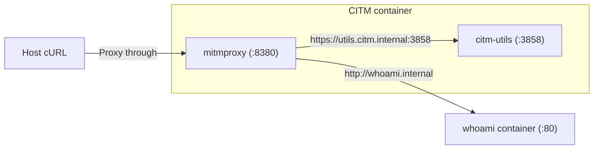

# HTTP Proxy and DNS Forwarder

This tutorial shows how to use CITM as an HTTP proxy (handled by `mitmproxy`)
while using the CITM DNS forwarder for internal name resolution.

### Prerequisites

Required tools and inputs:

- **Docker** and **Docker Compose**

- **cURL**

- A Root CA certificate and key (`rootCA.pem`, `rootCA-key.pem`)

- An external Docker network named `my-citm-network`, created with:

  ```bash
  docker network create my-citm-network
  ```

Certificate generation is documented in
**[Development Root CA Generation](../how-to/create-dev-root-ca.md)**.

### Architecture

- **CITM gateway**: Exposes `8380` to the host and registers `gateway.internal`
  through `citm_dns_names`.
- **whoami**: Registers `whoami.internal` through `citm_dns_names`.
- **Host client**: Sends requests through CITM by setting `http_proxy` and
  `https_proxy`.



### Gateway Service

File: `examples/http-proxy-and-dns-forwarder/compose.yml`

```yaml
name: citm-examples-http-proxy-and-dns-forwarder

services:
  citm:
    image: fardjad/citm:latest
    volumes:
      # Required for service discovery
      - /var/run/docker.sock:/var/run/docker.sock:ro
      # A directory containing rootCA.pem and rootCA-key.pem
      - ./certs:/certs:ro
    environment:
      # Discover services in this network
      - CITM_NETWORK=my-citm-network
    labels:
      # Register this service in the CITM network
      - citm_network=my-citm-network
      - citm_dns_names=gateway.internal
    ports:
      # Expose only the HTTP proxy port
      - "0.0.0.0:8380:8380"
    networks:
      - my-citm-network

networks:
  my-citm-network:
    name: my-citm-network
    external: true
```

### Backend Service

The backend service is defined in the same
`examples/http-proxy-and-dns-forwarder/compose.yml` file:

```yaml
  whoami:
    image: traefik/whoami
    networks:
      - my-citm-network
    labels:
      # Register this service in the CITM network
      - citm_network=my-citm-network
      - citm_dns_names=whoami.internal
```

### Verification

Start the stack:

```bash
cd examples/http-proxy-and-dns-forwarder
docker compose up -d \
  --wait \
  --pull always \
  --build \
  --force-recreate
```

Set proxy environment variables in the shell session:

```bash
export http_proxy=http://127.0.0.1:8380
export https_proxy=http://127.0.0.1:8380
```

#### 1. Reach the Gateway Utils Endpoint

```bash
curl -k https://utils.citm.internal:3858
```

This request targets the `utils` endpoint in the CITM container on port `3858`.
Expected result: JSON output that includes `dns_entries`.

#### 2. Reach whoami Directly by DNS Name

```bash
curl http://whoami.internal
```

`whoami` listens on port `80` by default. Because the `whoami` container has
`citm_network` and `citm_dns_names=whoami.internal`, CITM discovers it and
registers that DNS name. With CITM configured as the proxy, `whoami.internal`
resolves inside CITM and the request is forwarded directly to `whoami:80`.
