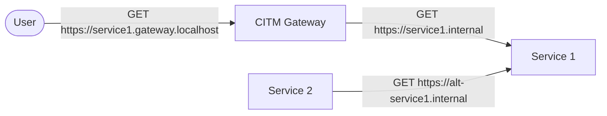

# Mixed-Mode Deployment

This tutorial documents a mixed-mode CITM environment that combines a gateway
deployment with sidecar deployments. The walkthrough covers topology, Caddy
configuration, and inspection paths for both gateway and sidecar traffic.

### Prerequisites

The following tools are required to initialize the environment and follow this
tutorial:

- **Docker** and **Docker Compose**

- **cURL** and **jq** (to execute requests and parse API responses in the
  examples)

- An external Docker network named `my-citm-network`. This network must be
  initialized via:

  ```bash
  docker network create my-citm-network
  ```

- A Root CA certificate (`rootCA.pem`) and key (`rootCA-key.pem`) within a
  designated directory. Certificate generation is documented in
  **[Development Root CA Generation](../how-to/create-dev-root-ca.md)**.

### Architecture

- **Gateway**: Exposes ports to the host interface and routes traffic to
  internal services.
- **Service 1**: A target application accessible via the gateway.
- **Service 2**: An internal service that communicates with Service 1 via the
  internal DNS name.



### Gateway Service

The gateway operates as the central ingress point. It binds to the host's
primary HTTP/HTTPS ports and requires access to the Docker socket to monitor
container lifecycles for dynamic DNS registration.

`gateway/compose.yml`:

```yaml
services:
  citm:
    image: fardjad/citm:latest
    networks:
      - my-citm-network
    environment:
      # discover the services in this network
      - CITM_NETWORK=my-citm-network
    ports:
      # Caddy ports
      - "443:443"
      - "443:443/udp"
      - "80:80"
    volumes:
      # Required for service discovery
      - /var/run/docker.sock:/var/run/docker.sock:ro
      # A directory containing rootCA.pem and rootCA-key.pem
      - ./path/to/certs:/certs:ro
      # A directory containing Caddy config files
      - ./caddy-conf.d:/etc/caddy/conf.d:ro

networks:
  my-citm-network:
    name: my-citm-network
    external: true
```

The gateway requires Caddy configuration to route incoming traffic to specific
backend services. The following configuration instructs the gateway to intercept
traffic for `service1.localhost` and forward it to the internal
`service1.internal` DNS name.

`gateway/caddy-conf.d/service1.conf`:

```caddy
service1.localhost, alt-service1.localhost {
	# Enable on-demand TLS for this site configuration
	import dev_certs

	reverse_proxy {
		# This can be anything but localhost, so that the request goes through MITMProxy
		to mitm

		# Flow marker for MITMProxy to be able to distinguish flows easier
		header_up X-MITM-Emoji ":one:"
    # Route the request to the service via its internal DNS name
		header_up X-MITM-To "service1.internal:443"

		header_up Host "service1.internal"

		transport http {
			tls
		}
	}
}
```

The gateway also configures administrative routing. Caddy in the Middle exposes
three primary internal services on its administrative port (`3858`):

1. An info endpoint (`/`) returning a JSON payload of environment metadata.
1. A HAR dump endpoint (`/har`) returning captured flows in HTTP Archive format.
1. The `mitmproxy` web UI for real-time traffic inspection.

Because these services are internal to the container network, we must add
specific routing rules to make them accessible from the host machine:

`gateway/caddy-conf.d/citm.conf`:

```caddy
# Gateway Configuration
# Intercepts requests to *.citm.localhost (e.g., mitm.citm.localhost, utils.citm.localhost)
*.citm.localhost {
	import dev_certs

	reverse_proxy {
		# The `{labels.2}` placeholder extracts the third segment from the right (e.g., 'mitm' or 'utils').
		# This dynamically proxies the request to the matching internal utility on port 3858.
		to "{labels.2}.citm.localhost:3858"

		transport http {
			tls
			network_proxy none
		}
	}
}

# Sidecar Configuration
# Intercepts requests to *.citm.<service_name>.localhost (e.g., mitm.citm.service1.localhost)
*.citm.service1.localhost {
	import dev_certs

	reverse_proxy {
		# The `{labels.1}` placeholder extracts the second segment from the right ('service1').
		# This dynamically proxies the request to the target sidecar's internal DNS name over the Docker network.
		to "{labels.1}.internal:3858"

		# The `{labels.3}` placeholder extracts the fourth segment from the right ('mitm' or 'utils').
		# This ensures the `Host` header is preserved when the request reaches the target sidecar.
		header_up Host "{labels.3}.citm.localhost:3858"

		transport http {
			tls
			tls_server_name citm.localhost
			network_proxy none
		}
	}
}
```

### Backend Services

An internal service can be exposed to the CITM network by attaching a
`citm-sidecar` container to its network namespace. The sidecar handles all
internal DNS resolution, TLS termination, and traffic proxying on behalf of the
application container.

`service1/compose.yml`:

```yaml
services:
  citm-sidecar:
    image: fardjad/citm:latest
    networks:
      - my-citm-network
    labels:
      # register this service in the CITM network
      - citm_network=my-citm-network
      - citm_dns_names=service1.internal,alt-service1.internal
    environment:
      - CITM_NETWORK=my-citm-network
    volumes:
      - /var/run/docker.sock:/var/run/docker.sock:ro
      - ./path/to/certs:/certs:ro
      - ./caddy-conf.d:/etc/caddy/conf.d:ro

  service1:
    image: traefik/whoami
    command: --port 8080
    network_mode: "service:citm-sidecar"

networks:
  my-citm-network:
    name: my-citm-network
    external: true
```

Because `service1` communicates securely over HTTPS using the internal PKI, its
sidecar requires a Caddy configuration to terminate incoming TLS traffic and
forward the plaintext request to the local application port (8080).

`service1/caddy-conf.d/service1.conf`:

```caddy
service1.internal, alt-service1.internal {
	import dev_certs

	reverse_proxy {
		to mitm

		header_up X-MITM-Emoji ":one:"
		header_up X-MITM-To "localhost:8080"

		header_up Host "localhost:8080"
	}
}
```

The second service operates as an internal client. It executes requests against
`service1.internal`. Because it acts as a client, it requires the custom Root CA
to be mounted and trusted by the execution environment (in this case, via the
`SSL_CERT_FILE` environment variable for Python).

`service2/compose.yml`:

```yaml
services:
  citm-sidecar:
    image: fardjad/citm:latest
    networks:
      - my-citm-network
    environment:
      - CITM_NETWORK=my-citm-network
    volumes:
      - /var/run/docker.sock:/var/run/docker.sock:ro
      - ./path/to/certs:/certs:ro

  service2:
    image: python:3-alpine
    network_mode: "service:citm-sidecar"
    environment:
      # Tell Python to trust the custom Root CA mounted below
      - SSL_CERT_FILE=/certs/rootCA.pem
    volumes:
      - ./path/to/certs:/certs:ro
    command: |
      python -u -c '
      import urllib.request
      import time
      
      while True:
          try:
              print("Sending request to https://service1.internal...")
              req = urllib.request.urlopen("https://service1.internal")
              print(f"Success! Status: {req.getcode()}")
          except Exception as e:
              print(f"Request failed: {e}")
          time.sleep(5)
      '

 networks:
   my-citm-network:
     name: my-citm-network
     external: true
```

### Inspecting the Environment

Following initialization, the environment state and captured traffic can be
inspected via the administrative endpoints exposed through the gateway.

These services are mapped to specific domains via routing rules defined in
`gateway/caddy-conf.d/citm.conf`:

- **Gateway administrative traffic (`*.citm.localhost`)**: The gateway routes
  these requests to its internal administrative interface.
- **Sidecar administrative traffic (`*.citm.<service>.localhost`)**: The gateway
  proxies these requests over the internal Docker network to the corresponding
  sidecar container.

#### 1. DNS Registration

The internal DNS registry can be queried via the gateway's utility endpoint.
Executing a request to this endpoint reveals the registered `citm_dns_names`
under the `dns_entries` key.

```bash
curl -s -k https://utils.citm.localhost | jq '.dns_entries'
```

#### 2. Gateway Traffic Inspection

Requests processed by the gateway, such as a GET request to
`https://service1.localhost`, are captured by the gateway's `mitmproxy`
instance. These captured flows can be inspected via the gateway's `mitmweb`
interface at `https://mitm.citm.localhost`.

#### 3. Sidecar Traffic Inspection

Internal traffic originating from `service2` and targeting the `service1`
sidecar is captured by the `service1` `mitmproxy` instance. These specific
sidecar flows can be inspected via `https://mitm.citm.service1.localhost`.

#### 4. HAR Exports

Captured flows for any given proxy instance can be exported in HTTP Archive
(HAR) format:

- **Gateway flows**: `https://utils.citm.localhost/har`
- **Service 1 sidecar flows**: `https://utils.citm.service1.localhost/har`
