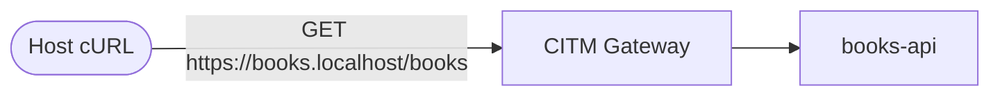

# Mocking

CITM has a built-in mocking feature. This tutorial shows how to use it.

### Prerequisites

The following tools are required:

- **Docker** and **Docker Compose**

- **cURL**

- A Root CA certificate and key (`rootCA.pem`, `rootCA-key.pem`)

- Stop other tutorial stacks before running this one. Multiple examples bind
  host ports `80/443`.

- An external Docker network named `my-citm-network`. Create it with:

  ```bash
  docker network create my-citm-network
  ```

Certificate generation is documented in
**[Development Root CA Generation](../how-to/create-dev-root-ca.md)**.

### Architecture

- **Host client**: Calls `https://books.localhost/books`.
- **CITM gateway**: Terminates TLS and forwards traffic to `mitmproxy`.
- **books-api**: A small Python service that returns a list of books.



### Gateway Service

File: `examples/mocking/compose.yml`

```yaml
name: citm-examples-mocking

services:
  citm:
    image: fardjad/citm:latest
    volumes:
      - /var/run/docker.sock:/var/run/docker.sock:ro
      - ./certs:/certs:ro
      - ./caddy-conf.d:/etc/caddy/conf.d:ro
      # A directory containing mock templates
      - ./mocks:/citm-mocks:ro
    environment:
      - CITM_NETWORK=my-citm-network
      - MOCK_PATHS=/citm-mocks/**/*.mako
    ports:
      - "0.0.0.0:80:80"
      - "0.0.0.0:443:443"
      - "0.0.0.0:443:443/udp"
    networks:
      - my-citm-network

networks:
  my-citm-network:
    name: my-citm-network
    external: true
```

Caddy site configuration file: `examples/mocking/caddy-conf.d/books.conf`

```caddy
books.localhost {
	import dev_certs

	reverse_proxy {
		to mitm
		header_up X-MITM-To "books.internal:8000"
		header_up Host "books.internal:8000"
	}
}
```

### Backend Service

The backend service is defined in the same `examples/mocking/compose.yml` file:

```yaml
  books-api:
    image: python:3
    working_dir: /app
    command: python /app/books_app.py
    volumes:
      - ./app:/app:ro
    networks:
      - my-citm-network
    labels:
      - citm_network=my-citm-network
      - citm_dns_names=books.internal
```

The application file is `examples/mocking/app/books_app.py`:

```python
from __future__ import annotations

import json
from http.server import BaseHTTPRequestHandler, ThreadingHTTPServer


BOOKS = [
    {"id": 1, "title": "The Pragmatic Programmer"},
    {"id": 2, "title": "Clean Code"},
]


class BooksHandler(BaseHTTPRequestHandler):
    def do_GET(self) -> None:
        if self.path != "/books":
            self.send_response(404)
            self.send_header("Content-Type", "application/json")
            self.end_headers()
            self.wfile.write(b'{"error":"not found"}')
            return

        body = json.dumps(BOOKS).encode("utf-8")
        self.send_response(200)
        self.send_header("Content-Type", "application/json")
        self.send_header("Content-Length", str(len(body)))
        self.end_headers()
        self.wfile.write(body)

    def log_message(self, format: str, *args: object) -> None:
        return


def main() -> None:
    server = ThreadingHTTPServer(("0.0.0.0", 8000), BooksHandler)
    server.serve_forever()


if __name__ == "__main__":
    main()
```

### Mock Template

The example includes `examples/mocking/mocks/books.mako`:

```text
GET ~*://*/books

200
Content-Type: application/json
X-Source: mock

---
[
  {"id": 10, "title": "Design Patterns"},
  {"id": 11, "title": "Introduction to Algorithms"}
]
```

The pattern matches the `/books` endpoint while wildcarding scheme and host.

### Verification

Start the stack:

```bash
cd examples/mocking
docker compose up -d \
  --wait \
  --pull always \
  --build \
  --force-recreate
```

Call the endpoint:

```bash
curl -sS -i -k https://books.localhost/books
```

Expected output includes the mock header and body:

```http
HTTP/2 200
Content-Type: application/json
X-Source: mock

[
  {"id": 10, "title": "Design Patterns"},
  {"id": 11, "title": "Introduction to Algorithms"}
]
```
